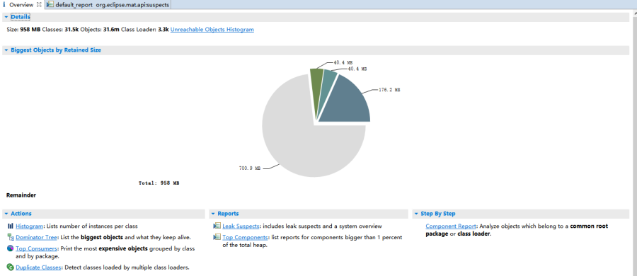

# mybatis-plus in使用不当导致的OOM问题

## 分析过程

### 定位内存溢出的代码片段

在MAT的首页可以看到有个对象占了700Ｍ的内存，如下图所示：



初步推测是因为这个大对象导致K8S中的erp-devops这个pod持续崩溃重启，接下来我们一步步分析究竟是程序的哪个环节产生了这么大的对象。

首先点击上图中的"Leak Suspects"，借助MAT工具帮我们找出产生这个大对象的程序调用堆栈，点击之后，如下图所示：


上图中经过MAT的分析，它推测有个本地变量持有大量的对象，而且也给出了产生这些对象的调用堆栈，点击"See stacktrace"，如下图所示：


重点请观察我在上图中标识出来的部分，到这里我们就定位出来了产生问题的代码入口为xxx.xxx.erp.devops.controller.common.DevopsMissionQueryController.getMissionAndRepairRecord 方法，更具体的说则是调用
xxx.xxx.erp.devops.service.impl.DevopsMissionExtServiceImpl.getListByMissionIds方法时查出了大量对象。方法实现如下所示：


该方法传入一个list集合通过in的方式去查询数据，如果这个方法返回大量的数据，有两种可能：

- list参数集合传了一个很大的集合，导致SQL查询出大量的数据
- 当list集合为空时，SQL没有带任何参数，查全表查出了大量的数据

到目前为止没有更多的线索来帮我们推断到底是上面的哪一种原因导致的，也有可能是另外的原因导致的。

### 定位内存溢出的根本原因

接下来，我们通过"Dominator Tree"来分析大对象的引用关系，看是否能找到更多的线索，在MAT的首页，按下图红框所示打开新的视图：


点击之后，结果展示如下：


通过上面的Stacktrace分析，我们已经知道这是由于SQL查询大量数据导致的，所以我们重点关注"com.mysql.cj.jdbc.ResultSetImpl"代表的对象。

对象为com.mysql.cj.jdbc.result.ResultSetImpl，可以得知这是一个SQL的查询结果集，要想回答前面提出的问题，只有找到执行的原始SQL，才可以找出问题的原因所在。

既然该对象是查询结果集，那无法通过查询它本身引用的对象找到对应的SQL语句，只有通过持有它的对象去查找。

在com.mysql.cj.jdbc.result.ResultSetImpl对象上点键右键，选择"List Objects -> with outgoing references"查看持有该对象的外部对象，如下图所示：


展开该对象可以看到该对象中有一个类型为com.mysql.cj.jdbc.ClientPreparedStatement的对象引用，看到这个就说明有希望了，因为该对象中肯定包含了SQL语句和相关的参数。 

继续查看ClientPreparedStatement对象引用了哪些对象，操作通过右击在com.mysql.cj.jdbc.ClientPreparedStatement对象，选择"List Objects -> with outgoing references"，展开该对象：


再次展开红色框中的query参数：


可以看到其中的originalSql，代表原始的SQL，把这个参数的值拿出来，SQL语句为:

```mysql-sql
SELECT id,`missionId`,`useStocks`,`recycleStocks`,`originMissionType`,`hasTransferred`,`hotRepairFlag`,`repairExceptionFlag`,`completeExceptionFlag`,`lat`,`lng`,`updateTime`,`createTime`
FROM devops_mission_ext_11
```

进一步展开queryBudings，可以看到该语句没有带任何查询条件：


那么实际执行的SQL为：

```mysql-sql
SELECT id,`missionId`,`useStocks`,`recycleStocks`,`originMissionType`,`hasTransferred`,`hotRepairFlag`,`repairExceptionFlag`,`completeExceptionFlag`,`lat`,`lng`,`updateTime`,`createTime`
FROM devops_mission_ext_11
```

把这条SQL语句拿出来执行一下统计查询，其结果将近10万条：


再回到下面这张图，我们看到有16个com.mysql.cj.jdbc.result.ResultSetImpl的对象，说明这张表一共分了16张表，每一张表将近10万数据，16张就是160万数据，一次性查询出来放入内存，这是导致内存溢出的根本原因。


## 修复方案
综上，我们知道了本次内存溢出的根本原因是：在下面这段代码中，当missionIds为空列表时，mybatis-plus拼装出来的sql不带任何查询条件导致了全表查询。


知道原因后，修复方案也就呼之欲出了。

**我们知道当传入的missionIds为空列表时，返回的DevopsMissionExt集合肯定是空的，根本不需要到数据库中去查询，所以只需要在构建SQL到数据库中查询之前，判断下missionIds是否为空列表，如果为空列表直接返回即可。**

当然这里还存在一个需要注意的点。那就是按照写这段代码的作者原意，当使用mybatis-plus的in方法时，如果传入的参数集合为一个空列表，那么框架为我们组装的SQL语句应该为in()，但实际上我们发现，这样的SQL mysql是没法执行的，如下图所示：


这里我们也去查了下Mybatis-plus的release记录，确实找到了相关fix bug的记录，如下图所示:


## 总结

这个案例告诉我们:

1. 在Dao层组装SQL到数据库查询数据之前，建议进行参数的完整性校验，如果参数不符合我们的期望，可以直接返回，尽量减少到数据库中查询数据的数据量。
2. 在使用框架的API时，当API中没有明确说明它的行为结果时，建议根据参数的边界值进行测试，只有在确定API的行为与我们的预期一致，才敢放心的使用。